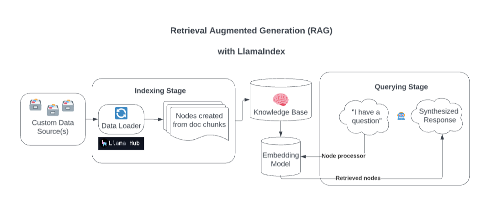

  <a href="https://fictionx.ai/">Website</a>
  <a href="https://x.com/FictionXAI">Twitter</a>

______________________________________________________________________

# FictionX Story Chat

AI RAG Chatbot for FictionX Stories.

It's powered by Llama Index, Together AI, Together Embeddings and Next.js. It embeds the stories in `story/data` and stores embeddings into `story/cache` as vector database locally. Then it role play as the character of the story and answer users' questions.

## What is LlamaIndex?

Behind the scenes, [LlamaIndex](https://docs.llamaindex.ai/en/latest/index.html) enriches your model with custom data sources through Retrieval Augmented Generation (RAG).

Overly simplified, this process generally consists of two stages:

- An indexing stage. LlamaIndex prepares the knowledge base by ingesting data and converting it into Documents. It parses metadata from those documents (text, relationships, and so on) into nodes and creates queryable indices from these chunks into the Knowledge Base.

- A querying stage. Relevant context is retrieved from the knowledge base to assist the model in responding to queries. The querying stage ensures the model can access data not included in its original training data.

source: [Streamlit](https://discuss.streamlit.io/t/build-a-chatbot-with-custom-data-sources-powered-by-llamaindex/49973)

## Getting Started

Copy your `.example.env` file into a `.env` and replace the `TOGETHER_API_KEY` with your own. Specify a dummy OPENAI_API_KEY value in this .env to make sure it works (temporary hack)

## How to 

1. Install the dependencies.

`npm install`

2. Run the app and submit your story urls to `http://localhost:3200/api/generate`.

`npm run dev`

3. Send messages to your chatbot on webpage or through API.

- webpage: `http://localhost:3200/`
- API: `http://localhost:3200/api/chat`

It supports streaming response or JSON response.